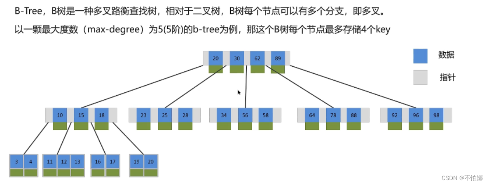
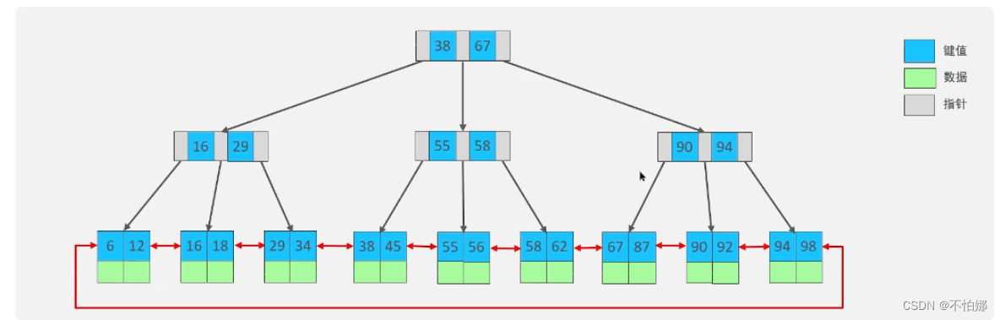

# 索引

## 了解过索引吗？(索引的底层原理)

**索引是提升查询速度的一种数据结构**。索引之所以能提升查询速度，在于它在插入时对数据进行了排序（显而易见，它的缺点是影响插入或者更新的性能）

如果没有索引，要找到某条特定的记录需要遍历整张表。在这种情况下，如果表中数据特别多，那么全表扫描就会很耗时，效率就会很低。但是如果将数据按照某种方式进行排序组合，比如[二叉搜索树](https://so.csdn.net/so/search?q=二叉搜索树&spm=1001.2101.3001.7020)，那么就不用全表扫描了。在mysql中，一般都是用B+树作为索引结构。

## B+树索引结构

要说为什么用B+树，就要说说为什么不使用其他的数据结构。不用二叉搜索树我认为有两个原因。一个是二叉树中每个结点最多有两个子节点，那么如果数据量很大的话，就会让这个二叉树变的很大，那么存储起来以及查找的时候次效率就不会太高。其次是在二叉搜索树中，极端情况下它会退化成为一个链表，链表的查找速率是很低的，综上，二叉搜索树不合适。红黑树也属于二叉搜索树，虽然避免了极端情况的出现，但它终究还是二叉树。所以也不使用。

那么接下来要解决的问题就是如何让一棵树变小，应该说是变矮。那就不能使用二叉树，这样就出现了B树，它是一种多叉路的平衡查找树。相对于二叉树，B树的每个结点可以有多个子节点。并且数据也是存储在B树里的。

而mysql实际使用的是B+树它是在B树基础上的一种优化，它更适合实现外存储索引结构。区别在于非叶子结点只存储指针，不存储数据。叶子结点存储真正的数据，并且叶子结点间链接成一个双向循环链表。所以非叶子结点就不需要特别大的存储容量。所以整体来说磁盘读写代价更低，效率更高。

